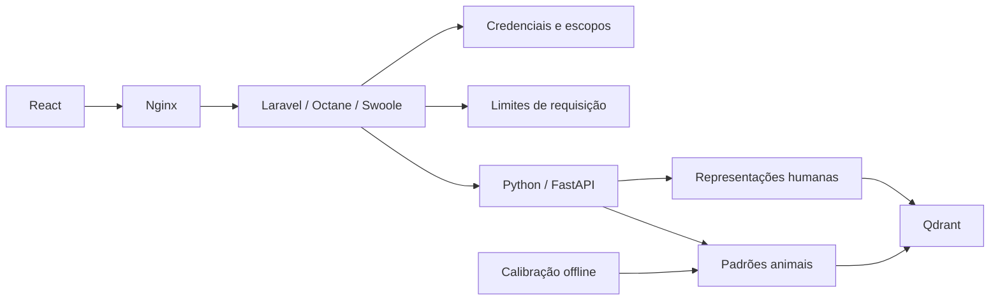

# Arquitetura

A fronteira pública é o gateway. O navegador nunca recebe o segredo do serviço Python nem a chave do Qdrant.

## Domínios e portas

| Parte | Responsabilidade | Fronteira |
| --- | --- | --- |
| Access | Validar credencial, espaço de trabalho e capacidades | `Principal`, `Authenticate` |
| People | Cadastro, filtros e consultas de pessoas | Um caso de uso por operação no gateway |
| Animals | Cadastro e similaridade de animais dentro da espécie | Contratos e repositório próprios |
| Recognition | Análise de rosto, métodos e prontidão | Casos de uso de consulta |
| Vision | Comunicação PHP → Python | Porta `VisionGateway` e adaptador `VisionClient` |
| Retrieval | Índices, distâncias e calibração | Porta `JsonStore`, adaptador `Qdrant` |
| Media | Limites, formato, orientação e decodificação de imagens | `decode_image` |

Os repositórios de pessoas e animais compartilham apenas a mecânica da coleção. Nenhum domínio animal herda regras de pessoas. As dimensões, normalização e identidade de uma representação ficam em `VectorSpace` e `Embedding`; parâmetros operacionais ficam em `policies.py`; endereços e segredos ficam na configuração de ambiente.

A ontologia mínima está em [ontology.json](ontology.json). Ela registra conceitos e relações estáveis. O contrato executável continua nos objetos de valor, schemas e casos de uso. Não há geração automática de camadas nem um diretório genérico de utilitários.

## PHP em processo persistente

Octane mantém o framework em memória. Rotas, configuração e autoload são preparados no build/start. OPcache está ativo inclusive no CLI. O processo roda sem privilégios de root, com dois workers e reciclagem a cada 500 requisições; os valores de workers e limite por minuto ficam em `.env`.

Não há Eloquent, sessões, cookies de autenticação, mail, filas, broadcasting, templates da aplicação ou scaffolding de autenticação. O provider de views continua registrado porque a fábrica de respostas do Laravel depende dele, inclusive para respostas JSON. Removê-lo quebraria uma dependência interna; isso não adiciona páginas Blade ao produto.

O gateway não guarda `Request`, usuário ou idioma em singletons próprios. `Principal` é imutável e pertence à requisição. O idioma é definido a cada chamada. O arquivo de credenciais é relido para permitir revogação sem reiniciar os workers. Redis mantém o limite por credencial entre os workers.

## Por que Qdrant

O caminho principal é recuperar vizinhos de um vetor com filtros conhecidos. Coleções têm índices HNSW e índices de payload para espaço de trabalho, nome normalizado, sexo, datas e localização. O cadastro de uma pessoa escreve dados, pontos e os dois vetores no mesmo ponto, evitando transações entre banco relacional e banco vetorial.

Cada espaço de trabalho participa do UUID interno e de todos os filtros. O ID público continua estável. Cabeçalhos de tenant enviados pelo navegador são ignorados pelo gateway; o tenant vem da credencial. Não há rota pública para consultar o Qdrant diretamente.

A alternativa PostgreSQL + pgvector faz mais sentido quando joins, transações relacionais e regras entre entidades passam a dominar o produto. Milvus é outra opção para cargas distribuídas maiores, com mais componentes operacionais. A porta de armazenamento permite mudar o adaptador depois de medir a carga real. Não duplicamos todos os dados em dois bancos só por antecipação.

HNSW é aproximado. `exact: true` compara os vetores elegíveis e serve como referência do índice. Cosine similarity maior significa candidato mais próximo; distância cosseno é `1 - score`. Scores de representações diferentes não são intercambiáveis e não são probabilidades de identidade.

## Evolução e compatibilidade

Uma mudança de pesos, alinhamento, normalização, crop ou dimensão cria uma nova versão da representação. Se a dimensão ou distância de uma coleção existente não corresponder ao contrato, o serviço recusa a inicialização. Não reindexe silenciosamente uma coleção em uso.

Para migrar: faça backup, crie outra coleção versionada, reprocesse somente imagens autorizadas disponíveis na origem, compare recall/latência e troque a leitura após validar. A aplicação não conserva imagens originais para reprocessamento futuro.

Fontes: [Octane](https://laravel.com/docs/13.x/octane), [índices do Qdrant](https://qdrant.tech/documentation/manage-data/indexing/), [pgvector](https://github.com/pgvector/pgvector).

## Contrato e clientes

O gateway continua sendo a única entrada pública. O envelope multipart termina nos adapters HTTP: a aplicação Python recebe bytes e parâmetros tipados, sem depender de base64. O JSON anterior é decodificado na mesma fronteira. O PHP abre o upload como stream e encerra o recurso após a chamada; o Python limita bytes e campos durante o parsing.

`services/gateway/resources/contracts/openapi.json` é o artefato público gerado por `scripts/build_contract.py`. O teste de contrato verifica a geração e as respostas reais. `sdk/dart` concentra transporte e tipos consumidos pelo próximo aplicativo, sem estado de tela ou acesso direto ao armazenamento vetorial.

Veja a [decisão de transporte](decisions/001-image-transport.md). Capacidade de streaming de vídeo, contas de usuário e login móvel são integrações futuras; não são endpoints vazios no contrato atual.
